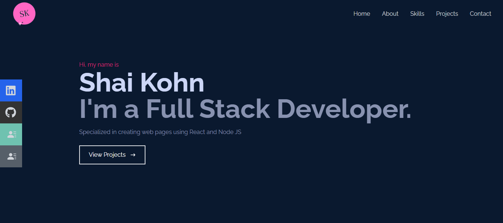
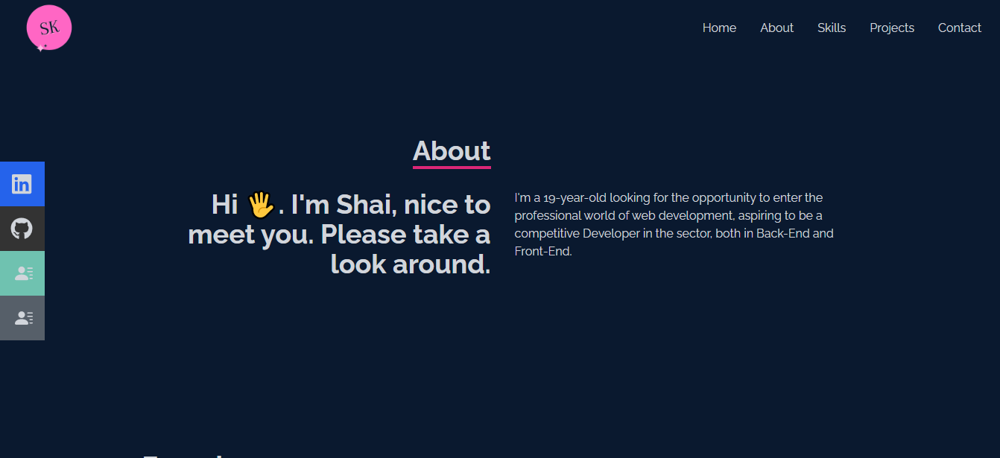

# My porfolio

## Spanish

Mi portafolio personal deployeado y realizado utilizando React y Tailwind CSS.
 Este incluye las siguientes caracteristicas:

- Una portada con una breve presentación
- Un NavBar
- Un About Me
- Una sección que expone las diferentes tecnologías que sé utilizar
- Una sección que expone mis proyectos
- Unformulario de contacto

## English

My personal portfolio deployed and made it with React and Tailwind CSS.
 It includes the following features:

- A title page with a short presentation
- A NavBar
- An About Me
- A section with the diferents technolgies that I know to use
- A section with my projects
- A contact form

